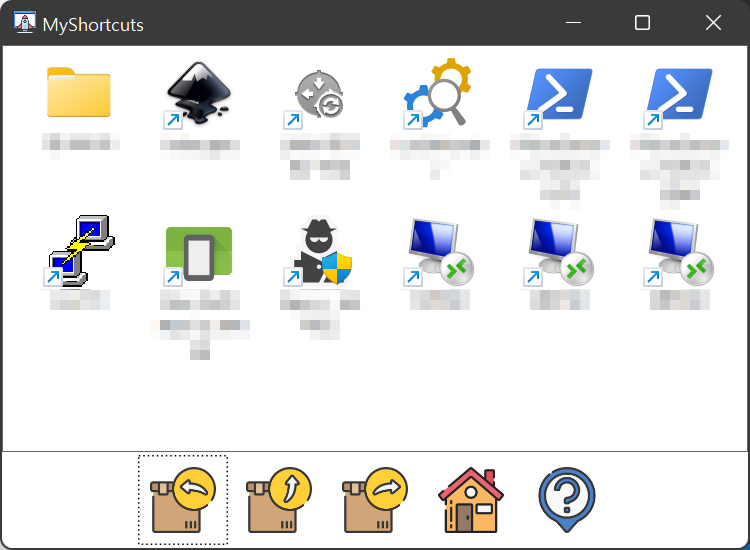

# MyShortcuts

## 소개

Windows 11로 업데이트 되면서 시작 메뉴가 작아지고 작업 표시줄에 넣기에는 아이콘이 동일해서 헷갈리고 하는 문제가 있어 특정 폴더만 보여주는 탐색기?를 하나 만들었습니다.

## 기능

- %USERPROFILE%\Shortcuts 폴더가 표시됩니다.
- %USERPROFILE%\MyShortcuts.config 파일이 생성되어 몇가지 설정을 할 수 있습니다.
  프로그램에서도 설정 파일 쓰기를 하므로 편집 전에 프로그램을 종료해야 합니다.
- 원하는 항목을 선택 실행하여 포커스를 읽게 되면 열린 창의 가장 아래로 창이 이동하여 화면에서 가려집니다.
- - 설정으로 동작을 변경할 수 있습니다.
  - 최소화 기능을 사용하면 탐색기의 속성창과 같은 다이얼로그들과 충돌이 발생할 수 있습니다.
- 몇가지 단축키를 제공합니다.
  - Alt + Left: 히스토리 뒤로 이동
  - Alt + Right: 히스토리 앞으로 이동
  - Alt + Up: 상위 폴더로 이동
  - Alt + Home: 지정 폴더로 이동
  - Alt + Insert: 현재 폴더를 지정 폴더로 저장
  - Alt + 1: 비활성화 동작 설정
  - Alt + 2: 활성화 폴더 변경 동작 설정
  - Alt + 3: 창 위치/크기를 저장
  - F1: 도움말 및 정보
  - 화면 하단의 버튼으로도 동일 기능을 사용할 수 있습니다.
- 일반 탐색기의 옵션처럼 한 번 클릭으로 실행되도록 하는 옵션이 있습니다.
  설정 파일 편집으로만 수정 가능합니다.

## 아이콘 제공

- Icons made by <a href="https://www.flaticon.com/authors/juicy-fish" title="juicy_fish">juicy_fish</a> from <a href="https://www.flaticon.com/" title="Flaticon">www.flaticon.com</a>
  home / return / startup / unknown

## 사용 도구

- MS Windows 11 Pro 21H2(22000.194)
- MS Visual Studio Community 2022
- Windows SDK 10.0.19041.0
- .NET Framework SDK 4.8
- Typora version 0.11.8(beta) [Home](https://typora.io/) - 마크다운 편집기
- Krita 4.4.8 [Home](https://krita.org/ko/) - PNG 편집, ICO 생성
- Notepad++, TortoiseGit, Firefox, etc...

## 변경 사항

- 2022-02-10
  
  - 창 고정 기능 관련된 것을 모두 제거했습니다.
    딱히 사용하면서 해당 기능이 필요하지 않아서...

## 참고 사항

- 프로그램은 2개로 구성되어 있습니다.  
  따라서 실행할 떄 2개 파일이 같은 폴더에 있어야 합니다.
  - MyShortcutInterop.dll: Win32 API를 사용해 COM 객체에 접근하는 DLL
  - MyShortcuts.exe: UI를 담당하는 WPF 응용 프로그램
- 64비트 Windows만 지원합니다.
